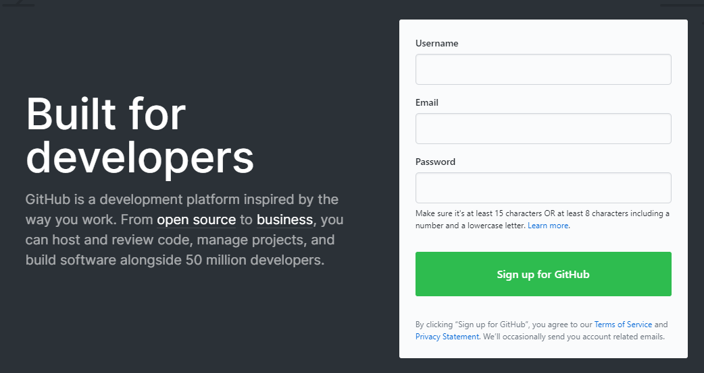
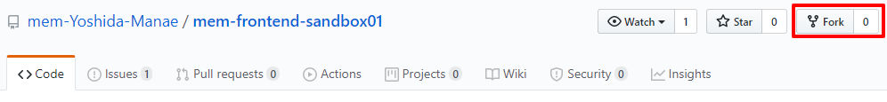
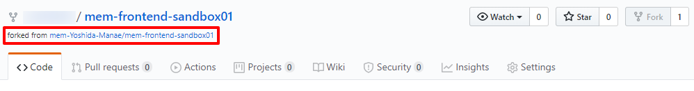
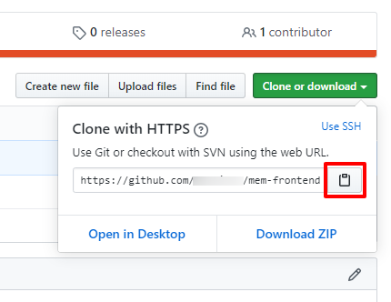
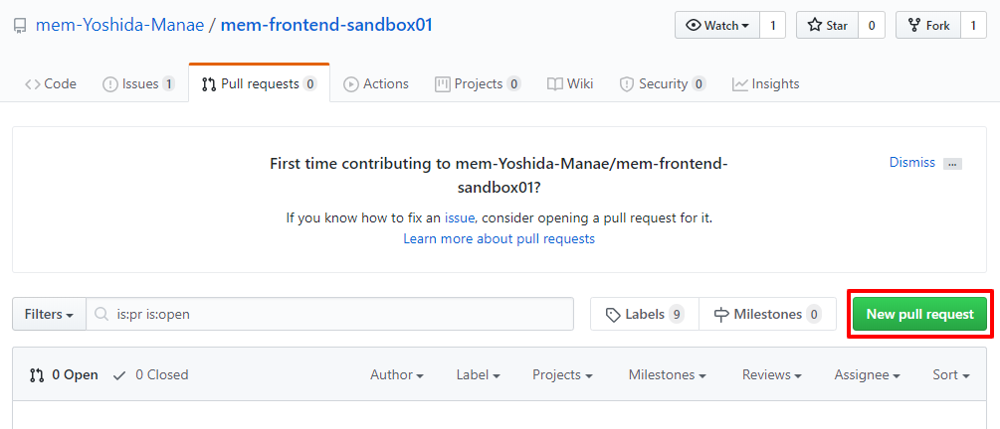

# フロントエンド講座 LV2 GitHub Flow 編
この課題では実際に GitHub アカウントを作成し、プルリクエスト(以下、PR)を出してもらいます。  
## 手順
1. まずは GitHub アカウントを作りましょう。  
ここで用いるアカウントは、会社用・個人用・今回だけ使う捨てアカウントいずれもOKとします。  
https://github.com/  

1. アカウントを作成したら、このリポジトリをフォークしてください。  
  
フォーク後、以下のように `forked from ***` と表示されたページに遷移したらフォーク完了です。  

1. フォークしたリポジトリをローカルにクローンしてください。  
クローン用の URL は以下のボタンから取得できます。  

1. #1 の Issue の内容を確認し、このリポジトリ内のファイルに修正を行ってください。  
1. 修正ができたら、master ブランチとは別のブランチを新たに切って、そこにコミットします。  
そのブランチをフォークしたリポジトリにプッシュしてください。  
※ ブランチ名は何でもOKです  
1. フォーク元リポジトリに PR を出してください。  
※ PR のタイトルやコメントは、#1 の Issue の内容に沿って簡潔な報告をお願いします(1~2行で可)。  
※ 誰がどの PR を出したか判断するため、classroom にて PR の URL をお知らせください。

1. 修正内容が問題無ければ、こちらで approve (PR にOKを出すこと)をして、クローズします（本来はマージするところですが、後続の PR のためクローズし、master には反映しません）。クローズされれば課題完了とします。  

## upstream について
今回の課題では簡易的な操作のみ行うため、「自分が PR を準備している間に、フォーク元の master に別の人からの新しいコミットが入りコンフリクトしてしまった」という現象は起こりません。  
しかし実際の GitHub の運用ではよく起こるシチュエーションです。  
これを解決するため、「フォーク元とフォーク先両方をリモートリポジトリとして設定する」ということを行います。  

`git remote add upstream (フォーク元リポジトリの URL)`  
こうすることで  
`git pull upstream master`  
といったコマンドを入力すれば upstream (=フォーク元リポジトリ)からブランチをプルすることができます。  
このリモートリポジトリの名前は何でも良いのですが、慣習として upstream という名前が使われることが多いです。

今回の課題では行いませんが、知識として覚えておきましょう。  
